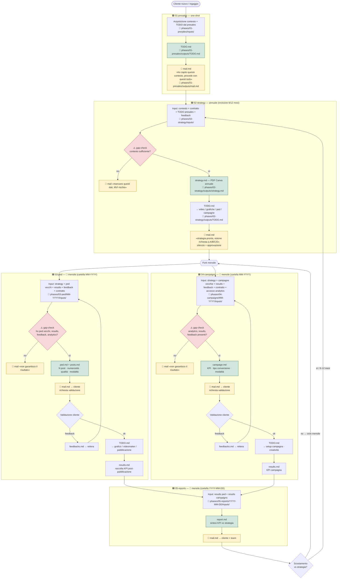

# Flusso operativo — Cliente tipo

Documento unico che visualizza il processo standardizzato definito nel meeting del 20/05/2026 e riflesso nella struttura `phases/`.

Ogni fase ha sempre la stessa anatomia:

- `inputs/` → contesto + `feedbacks.md` ricevuti
- `outputs/` → artefatto della fase + `mail.md` (touch-point formale) + `TODO.md` (genera la fase successiva)
- per le fasi ricorrenti (`03-ped`, `04-campaigns`, `05-reports`) c'è una sotto-cartella datata `MM-YYYY` / `YYYY-MM-DD`

Legenda: 🟦 fase · 📧 mail di touch-point · 🔁 loop ricorrente · ⚠️ gap-check · 📁 path nel repo

---

## 1. Diagramma end-to-end



---

## 2. Anatomia per fase

| # | Fase | Cadenza | Input principali | Decisioni / processo | Output (file) | Touch-point email |
|---|------|---------|------------------|----------------------|---------------|-------------------|
| 01 | `presales` | one-shot per cliente | contesto cliente, contratto, todo del commerciale | comprensione e formalizzazione todo | `TODO.md` | «contesto compreso, procedo con questi todo» |
| 02 | `strategy` | annuale (revisione 6/12 mesi) | contesto + contratto + `feedbacks.md` | strategia annuale (PDF Canva), parte testuale (Elisa) + parte creativa (Giovanni) | `strategy.md`, `TODO.md` | «strategia pronta, visione di A/B/C/D — silenzio = approvazione» |
| 03 | `ped/MM-YYYY` | mensile | `strategy` + ped vecchi + `results.md` + `feedbacks.md` + contratto | N post · numerosità · qualità · modalità | `ped.md`, `posts.md`, `results.md`, `TODO.md` | proposta al cliente + validazione, poi consegna a grafici/video |
| 04 | `campaigns/MM-YYYY` | mensile | `strategy` + campagne vecchie + analytics + `feedbacks.md` + contratto | KPI · tipo conversione · numerosità · modalità | `campaign.md`, `results.md`, `TODO.md` | proposta al cliente + validazione, poi setup operativo |
| 05 | `reports/YYYY-MM-DD` | mensile | `results.md` di ped + campaigns | sintesi KPI vs strategia | `report.md` | invio cliente + team, trigger eventuale revisione strategy |

---

## 3. Touch-point email (regola d'oro)

Da transcript 00:14:21 / 00:15:33: **ad ogni passaggio di fase parte una mail** che fissa lo stato, le decisioni prese e chi deve approvare. Vale come "freno di emergenza": se nessuno ferma, si procede.

```
presales ──📧──▶ strategy ──📧──▶ ped/campaigns ──📧──▶ cliente ──📧──▶ report ──📧──▶ (eventuale ri-strategia)
```

Ogni `mail.md` deve contenere:

1. **Cosa ho ricevuto** (riferimento ai file di `inputs/`)
2. **Cosa ho deciso / prodotto** (riferimento ai file di `outputs/`)
3. **Chi deve visionare / approvare** (nomi espliciti)
4. **Modalità di approvazione** (silenzio-assenso vs approvazione esplicita) + deadline
5. **Eventuali gap di contesto** (vedi §4)

---

## 4. Gap-check (⚠️) — meccanismo anti-output fallace

Da transcript 00:17:56 / 00:20:20: prima di produrre `ped.md` / `campaign.md` / `strategy.md`, controllare che siano disponibili:

- ✅ contesto cliente
- ✅ contratto / specifiche tecniche (numerosità asset, modalità)
- ✅ artefatti vecchi (ped vecchi, campagne vecchie)
- ✅ `results.md` storici
- ✅ `feedbacks.md` cliente
- ✅ accesso analytics

**Se anche solo uno manca → parte `mail.md` "mancano X, Y, Z; non posso garantire il risultato"** prima di procedere.

Caso cliente nuovo (storico vuoto): si formalizza la mitigazione del rischio (MVI) — primi 1-3 mesi senza garanzia di risultato, si raccolgono dati per cominciare a reiterare.

---

## 5. Loop temporali

| Loop | Frequenza | Innesco | Effetto |
|------|-----------|---------|---------|
| Validazione cliente (intra-fase) | per artefatto | `feedbacks.md` arrivati | rigenera `ped.md` / `campaign.md` |
| Operativo | mensile | inizio mese | nuova cartella `MM-YYYY` in `03-ped` e `04-campaigns`, nuovo `report` in `05-reports` |
| Strategico | 6 o 12 mesi, o su scostamento KPI | `report.md` fuori target | rigenera `strategy.md`, riparte il fork mensile |

---

## 6. Operatività "rumorosa" (fuori scope strategico)

Da transcript 00:21:35: attività operative quotidiane (video in ritardo, drag&drop, verifiche file) **non entrano nel diagramma strategico**. Vivono come:

- placeholder dentro `posts.md` (es. «video centro Giotto, giorno X»)
- TODO laterali delegabili a stagista / agenti specifici
- non bloccano il flusso principale

---

## 7. Mappa nodi diagramma ↔ filesystem

| Nodo | Path |
|------|------|
| `P1` inputs | `phases/01-presales/inputs/` |
| `P1OUT` | `phases/01-presales/outputs/TODO.md` |
| `P1MAIL` | `phases/01-presales/outputs/mail.md` |
| `P2` inputs | `phases/02-strategy/inputs/` (+ `feedbacks.md`) |
| `P2OUT` | `phases/02-strategy/outputs/strategy.md` |
| `P2TODO` | `phases/02-strategy/outputs/TODO.md` |
| `P2MAIL` | `phases/02-strategy/outputs/mail.md` |
| `P3IN` | `phases/03-ped/<MM-YYYY>/inputs/` |
| `P3OUT` | `phases/03-ped/<MM-YYYY>/outputs/ped.md` + `posts.md` |
| `P3RES` | `phases/03-ped/<MM-YYYY>/outputs/results.md` |
| `P3TODO` | `phases/03-ped/<MM-YYYY>/outputs/TODO.md` |
| `P3MAIL` | `phases/03-ped/<MM-YYYY>/outputs/mail.md` |
| `P4IN` | `phases/04-campaigns/<MM-YYYY>/inputs/` |
| `P4OUT` | `phases/04-campaigns/<MM-YYYY>/outputs/campaign.md` |
| `P4RES` | `phases/04-campaigns/<MM-YYYY>/outputs/results.md` |
| `P4TODO` | `phases/04-campaigns/<MM-YYYY>/outputs/TODO.md` |
| `P4MAIL` | `phases/04-campaigns/<MM-YYYY>/outputs/mail.md` |
| `P5IN` | `phases/05-reports/<YYYY-MM-DD>/inputs/` |
| `P5OUT` | `phases/05-reports/<YYYY-MM-DD>/outputs/report.md` |
| `P5MAIL` | `phases/05-reports/<YYYY-MM-DD>/outputs/mail.md` |
| Contesto globale | `context/` (incluso `context/contracts/contract.md`) |
